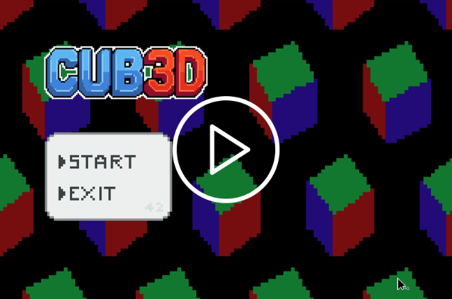
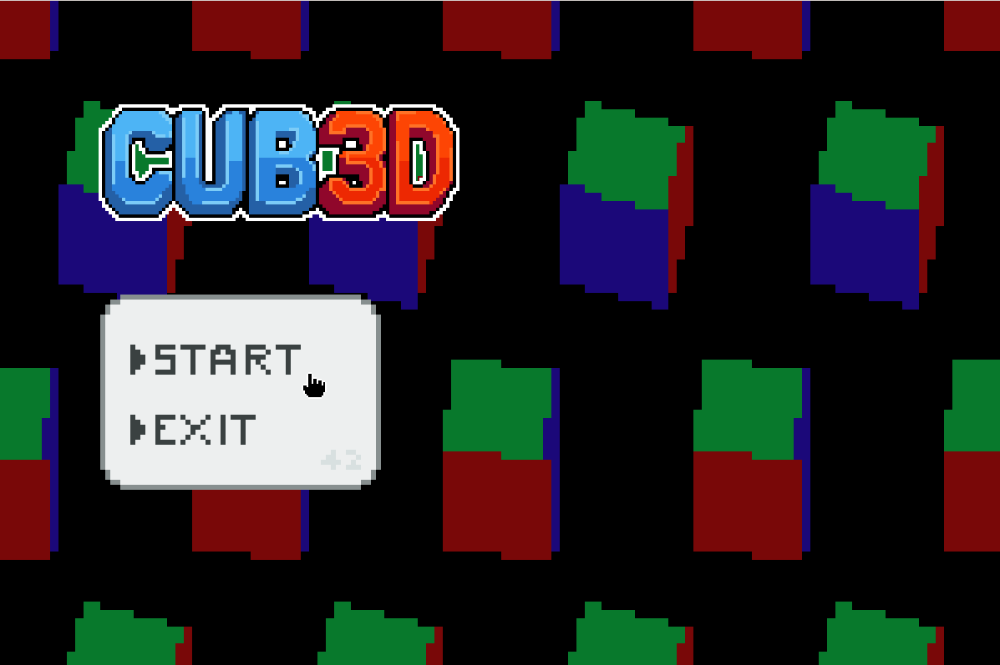
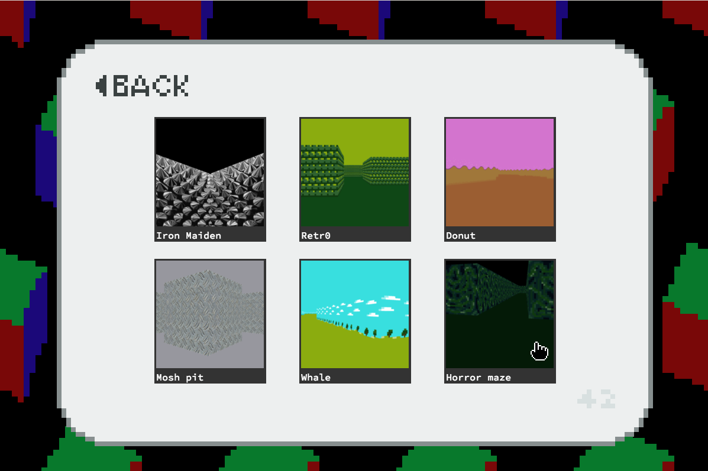
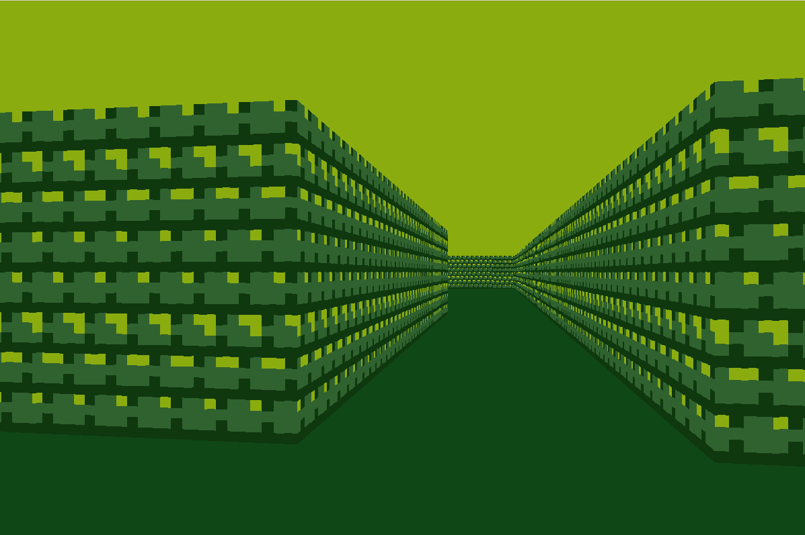
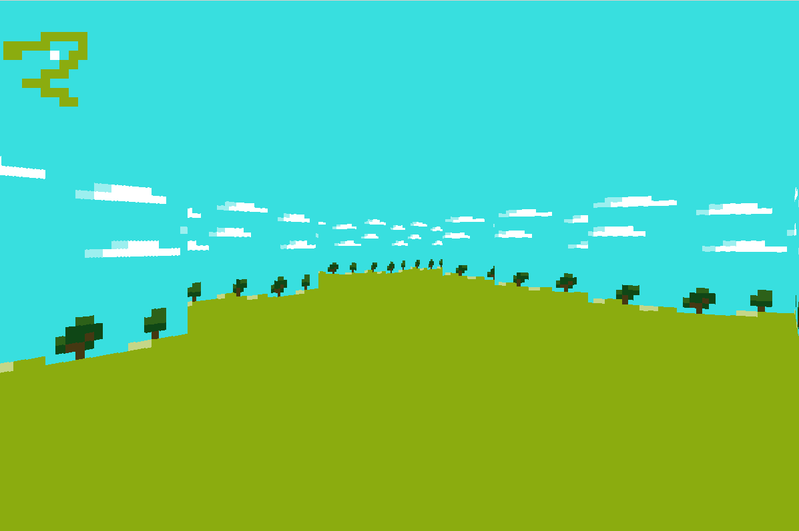
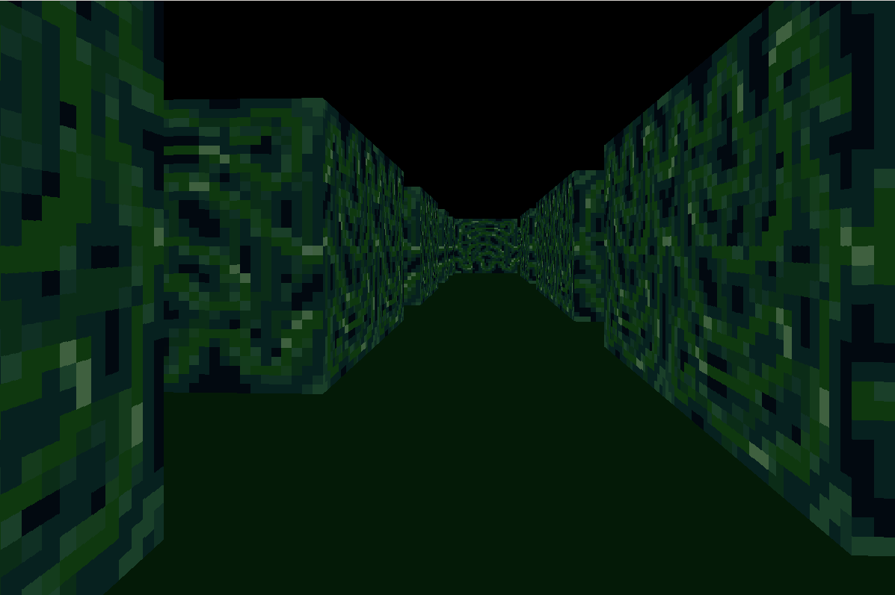
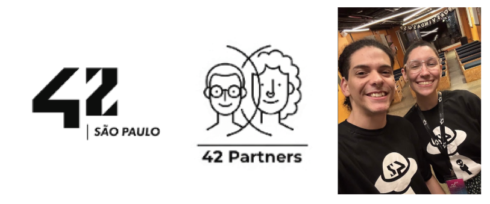

# cub3d


[ 🇬🇧 English Version 🇬🇧](https://github.com/42-Partners/cub3d/blob/main/_readme/english.md) ‎ ‎ ‎ ‎ | ‎ ‎ ‎ ‎ [Link do projeto (Intra)](https://projects.intra.42.fr/projects/cub3d/projects_users/4864496)


# Demo

[](https://github.com/42-Partners/cub3d/blob/main/_readme/cub3demo.mp4)

# Fotos







# Resumo

O **cub3d** é um projeto do currículo da 42 que desafia o estudante a criar um motor gráfico funcional inspirado no lendário *Wolfenstein 3D* (1992). O objetivo principal é explorar a técnica de **Raycasting**, transformando um mapa puramente bidimensional em uma representação visual 3D em tempo real, utilizando conceitos matemáticos de trigonometria, vetores e o eficiente algoritmo DDA.

# Introdução

Antes da era das GPUs modernas e dos polígonos complexos, os computadores tinham recursos extremamente limitados. Em 1992, a id Software revolucionou a indústria de jogos ao lançar o primeiro FPS (*First Person Shooter*) de sucesso: Wolfenstein 3D.

O segredo por trás dessa "mágica" não era um ambiente 3D real, mas sim uma técnica chamada **Raycasting**. Ao contrário do Raytracing moderno, que simula o comportamento físico da luz em todas as direções, o Raycasting simplifica o mundo para um grid 2D, permitindo que a renderização ocorra de forma extremamente rápida, mesmo em hardwares antigos.

# Contexto: O Mundo em 2D

Para o computador, o mapa do jogo é apenas uma matriz (grid) de inteiros. Um `1` pode representar uma parede e um `0` um espaço vazio. O desafio é: como saber o que o jogador vê a partir de uma coordenada `(x, y)` e um ângulo de visão?

Diferente de motores 3D modernos onde você define "câmeras", aqui trabalhamos com **Vetores de Direção** e o **Plano da Câmera**.

* **Vetor Direção (Dir):** Para onde o jogador está olhando.
* **Plano da Câmera (Plane):** Uma linha perpendicular ao vetor direção que define o FOV (*Field of View*).

# O Coração do Motor: Raycasting

A lógica fundamental do Raycasting é que, para cada coluna de pixels vertical na sua tela, você "lança" um raio a partir da posição do jogador.

O processo segue estes passos para cada raio:

1. **Cálculo da Direção:** Determinamos a direção do raio com base no plano da câmera e na coluna `x` da tela.
2. **Localização no Grid:** Identificamos em qual quadrado do mapa o jogador está.
3. **Trajeto do Raio:** Calculamos quanto o raio deve percorrer para cruzar uma linha do grid (seja horizontal ou vertical).

# O Algoritmo DDA (Digital Differential Analyzer)

Verificar ponto a ponto se um raio atingiu uma parede seria computacionalmente caro e impreciso. Para resolver isso, utilizamos o **DDA**.

O DDA é um algoritmo de "salto" em grids. Em vez de avançar em passos minúsculos, o raio pula diretamente para a próxima linha vertical ou horizontal do grid, onde quer que ela esteja mais próxima.

### Variáveis Críticas do DDA:

* **`deltaDistX/Y`**: A distância que o raio viaja de uma linha do grid para a próxima.
* **`sideDistX/Y`**: A distância da posição atual do jogador até a primeira linha do grid.
* **`stepX/Y`**: A direção do salto (positivo ou negativo).

Quando o DDA detecta que o quadrado atual do mapa é uma parede (`1`), ele para. Nesse momento, sabemos exatamente a distância percorrida.

# Renderização e Perspectiva

Uma vez que temos a distância do raio, precisamos projetar isso na tela. Aqui entra a **Projeção de Perspectiva**.

### Correção do Efeito "Olho de Peixe" (Fish-eye)

Se usássemos a distância euclidiana (direta do jogador até a parede), as paredes pareceriam curvas, pois os raios nas extremidades da visão são naturalmente mais longos que os do centro. Para corrigir isso, calculamos a **Distância Perpendicular** em relação ao plano da câmera.

### Altura da Parede

A altura da linha que desenharemos na tela é inversamente proporcional à distância: quanto mais longe a parede, menor ela aparece.

```c
lineHeight = (int)(h / perpWallDist);

```

# UI Dinâmica e Features Avançadas
Elevamos a imersão com uma interface construída via manipulação direta de buffers, garantindo transições fluidas e elementos interativos que fogem do padrão estático:

* **Animações Hover:** Feedback visual instantâneo nos botões via detecção de coordenadas do mouse.

* **Gestão de Estados:** Loop dedicado para transição estável e performática entre menus e gameplay.

* **Minimapa Real-time:** Sistema de navegação 2D sincronizado à posição e direção do jogador.

* **Olhar Vertical:** Expansão lógica do motor para permitir o movimento de pitching (olhar para cima/baixo).

# Conclusão

O **cub3d** é mais do que um jogo; é uma lição profunda sobre como a matemática pode ser usada para criar ilusões visuais complexas. Ao implementar o DDA e o Raycasting do zero, entendemos os fundamentos que permitiram o nascimento da era dourada dos jogos 3D.

"O verdadeiro Cub3d são os amigos que fazemos no caminho"

---

### Como Rodar

1. Clone o repositório:

```bash
git clone https://github.com/42-Partners/cub3d.git

```

2. Compile e execute o projeto:

```bash
make bonus

```

### Controles e Atalhos

O mapeamento de teclas foi projetado para oferecer uma experiência fluida de navegação e controle total sobre o motor gráfico:

| Tecla | Função |
| --- | --- |
| **`W` `A` `S` `D`** | Movimentação (Frente, Esquerda, Trás, Direita) |
| **`←` `→`** | Rotação horizontal da câmera |
| **`↑` `↓`** | Olhar vertical (*Pitching*) |
| **`MOUSE`** | Olhar horizontalmente e verticalmente |
| **`SHIFT`** | Correr (Aumento de velocidade) |
| **`M`** | Alternar exibição do Minimapa |
| **`ESC`** | Fechar o jogo e encerrar processo |

---

Feito por:

* [gustaoli](https://github.com/Gus1331)
* [rafaoliv](https://github.com/devrafaelly)


